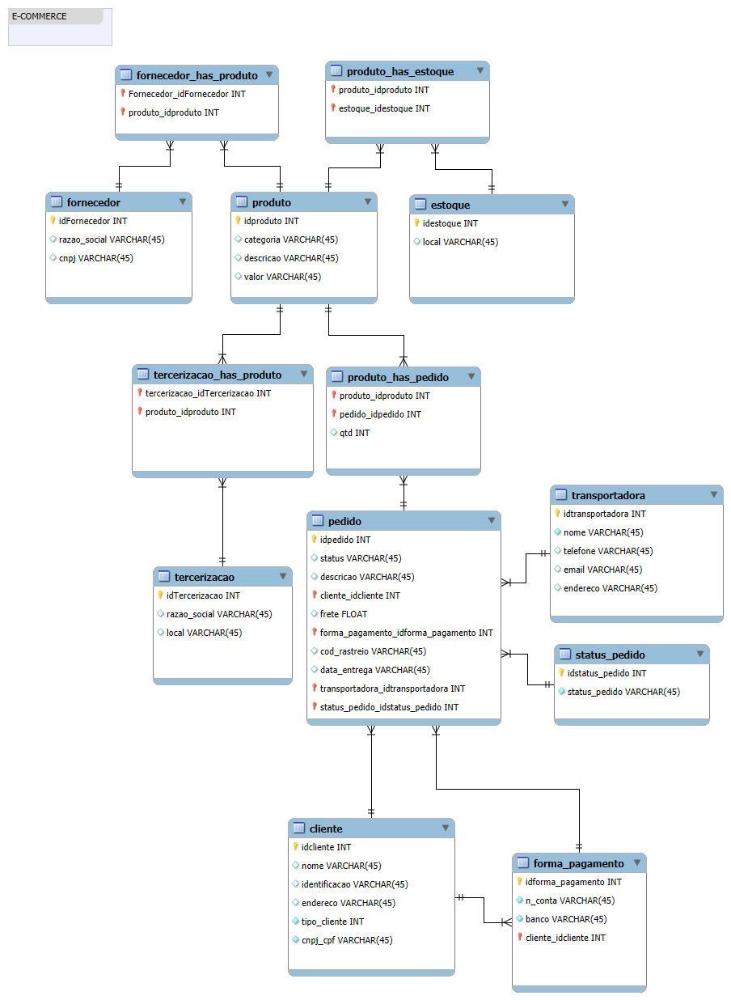
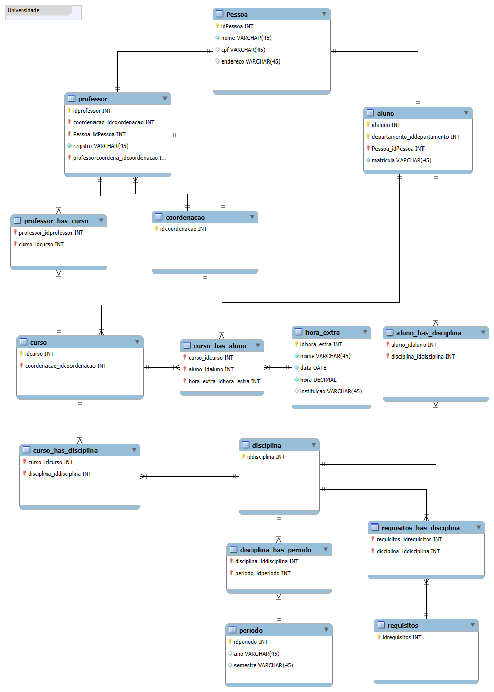
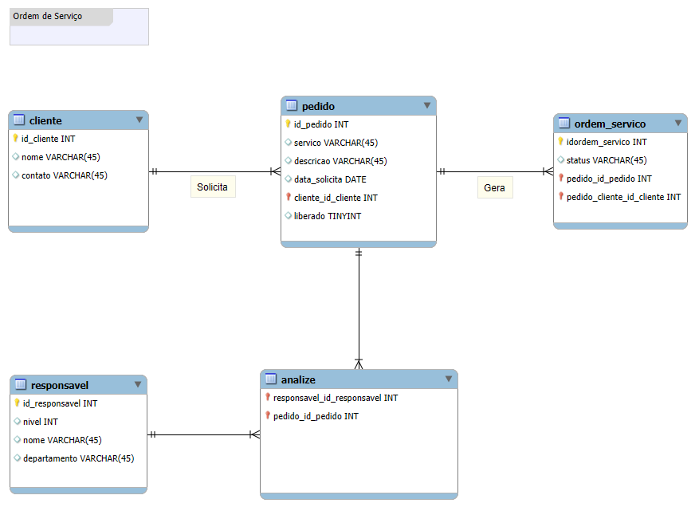

# 🧩 Primeito Desafio de Projeto

### 🎯 Objetivo 
Refinar um Projeto Conceitual de Banco de Dados - E-COMMERCE

## ✅ Pontos a serem considerados

- Cliente PJ e PF – Uma conta pode ser PJ ou PF, mas não pode ter as duas informações;
- Pagamento – Pode ter cadastrado mais de uma forma de pagamento;
- Entrega – Possui status e código de rastreio;

# Diagrama E-Commerce

## Outros Diagramas Desenvolvidos 

# Diagrama Universidade

# Diagrama Ordem de Serviço

