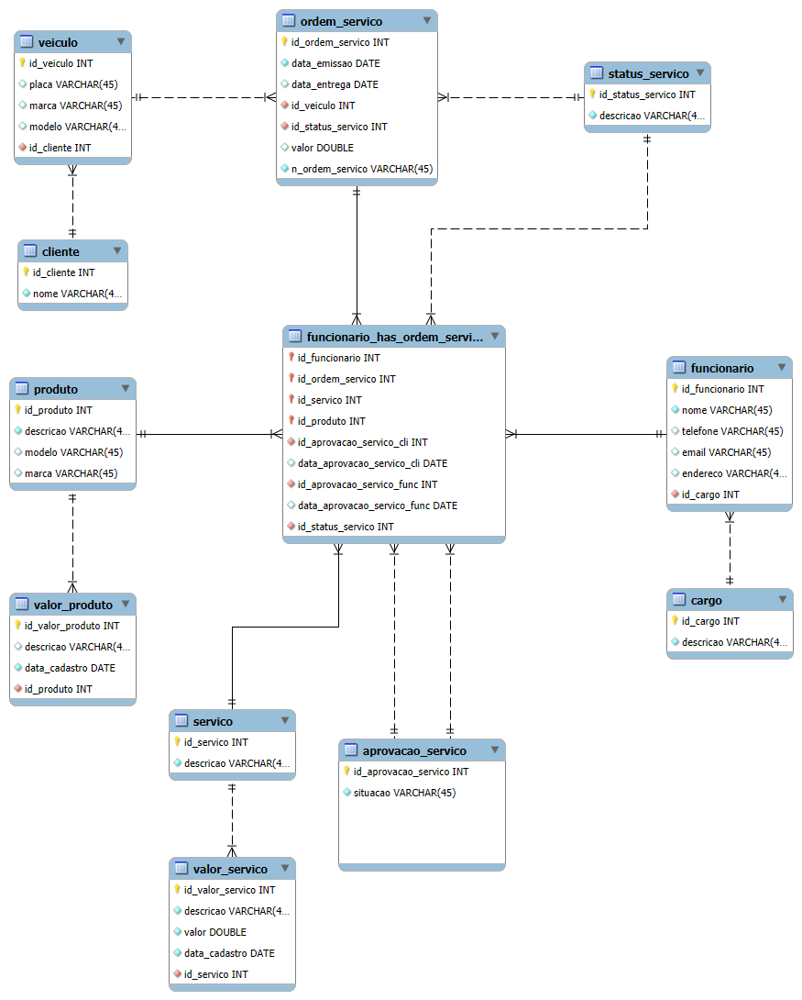

# 🔧 Quarto Desafio de Projeto – Banco de Dados para Oficina Mecânica

## 🎯 Objetivo
Desenvolver o projeto lógico de um banco de dados para o cenário de uma Oficina Mecânica, aplicando corretamente os conceitos de modelagem conceitual, lógica e relacional. O projeto contempla o uso adequado de chaves primárias, chaves estrangeiras, constraints, integridade referencial e relacionamentos complexos, conforme definido no modelo ER elaborado previamente.

Além da modelagem, o desafio envolve a criação do script SQL, a persistência de dados para testes e o desenvolvimento de consultas SQL mais complexas, permitindo a análise das informações do sistema da oficina.

---

## 📌 Escopo do Projeto

O banco de dados foi modelado para atender um sistema de gestão de oficina mecânica, contemplando:

- Cadastro de cargos e funcionários
- Controle de clientes
- Cadastro de veículos vinculados aos clientes
- Registro de ordens de serviço
- Controle de status da ordem de serviço
- Cadastro de serviços executados
- Cadastro de produtos utilizados nos serviços
- Processo de aprovação de serviços (cliente e funcionário)
- Histórico de valores de serviços
- Histórico de valores de produtos
- Relacionamento entre funcionários, ordens de serviço, serviços e produtos

---

## ✅ Refinamentos Aplicados ao Modelo

Conforme solicitado no desafio, foram aplicados os seguintes refinamentos:

- Funcionários e cargos  
  Cada funcionário está associado a um cargo específico, garantindo organização hierárquica dentro da oficina.

- Ordens de serviço  
  A ordem de serviço possui data de emissão, data de entrega, status do serviço, veículo associado, valor total e número identificador.

- Aprovação de serviços  
  Os serviços executados passam por aprovação do cliente e do funcionário, com registro das datas de aprovação.

- Relacionamentos complexos  
  Funcionário, ordem de serviço, serviço e produto estão relacionados de forma a permitir controle detalhado da execução e do status dos serviços.

---

## 🗂️ Diagrama Desenvolvido

### 🔧 Diagrama EER – Oficina Mecânica

---

## 🛠️ Tecnologias Utilizadas

- MySQL
- SQL (DDL e DML)
- Modelagem ER e Relacional
- Git e GitHub

---

## 🧱 Estrutura do Banco de Dados

O projeto contempla a criação das seguintes tabelas principais:

- cargo
- funcionario
- cliente
- veiculo
- status_servico
- ordem_servico
- servico
- produto
- aprovacao_servico
- funcionario_has_ordem_servico
- valor_servico
- valor_produto

Todas as tabelas foram criadas respeitando chaves primárias, chaves estrangeiras, constraints de unicidade e integridade referencial.

---

## 🧪 Persistência de Dados

Após a criação do esquema do banco de dados, foram inseridos dados fictícios para testes, possibilitando a validação dos relacionamentos, das constraints e das consultas SQL desenvolvidas.

---

## 🔍 Consultas SQL Desenvolvidas

As consultas SQL elaboradas atendem às diretrizes do desafio e incluem:

- Recuperações simples com SELECT
- Filtros com WHERE
- Criação de atributos derivados com expressões SQL
- Ordenações com ORDER BY
- Filtros em grupos utilizando HAVING
- Junções entre múltiplas tabelas com JOIN

---

## 📊 Exemplos de Perguntas Respondidas

- Quais são todos os veículos cadastrados na oficina?
- Quais ordens de serviço estão abertas ou em andamento?
- Quais serviços foram executados em cada ordem de serviço?
- Qual é o valor total de cada ordem de serviço?
- Quais ordens de serviço possuem valor acima de um determinado limite?
- Quantas ordens de serviço cada cliente possui?
- Quais veículos já passaram por manutenção e quem é o proprietário?
- Qual é o faturamento total da oficina?
- Qual a média de valor dos serviços cadastrados?
- Quantos veículos cada cliente possui?

As consultas completas encontram-se no arquivo `consultas_oficina.sql`, juntamente com as perguntas que cada consulta responde.

---

## 🚀 Considerações Finais

Este projeto permitiu aplicar, de forma prática, os conceitos de modelagem de banco de dados, SQL avançado e análise de dados, simulando um cenário real de uma oficina mecânica. O modelo foi desenvolvido com foco em organização, integridade dos dados e possibilidade de expansão futura.
